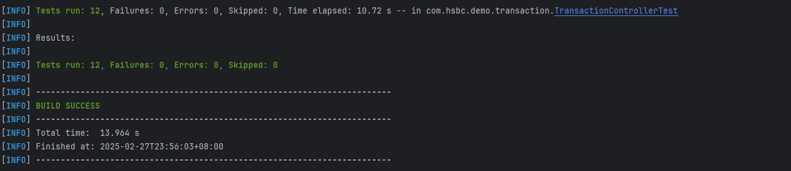
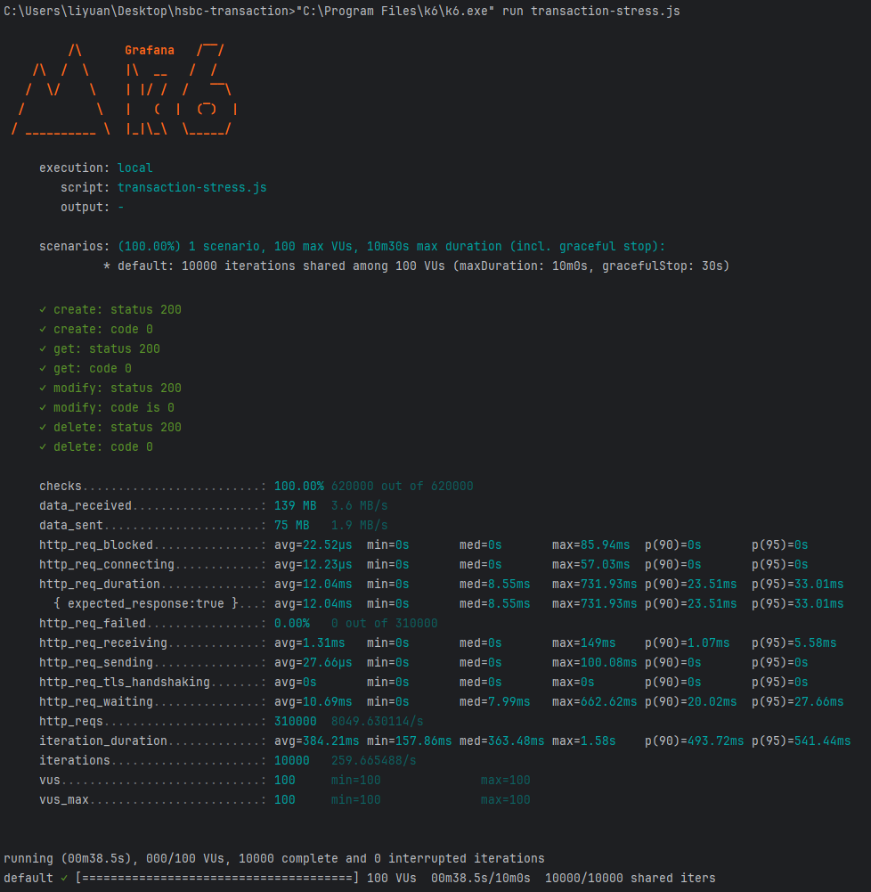

# 简介
本项目是hsbc面试homework，主要实现了一个transaction管理的CRUD；项目采用h2数据库存储在内存中，guava作为本地缓存；
# 项目运行及效果
1. 打jar包：`mvn package`, 命令成功运行后jar包路径为: `./target/hsbc-transaction-0.0.1-SNAPSHOT.jar`
2. 运行单元测试：`mvn test`

3. 压测命令：`k6 run transaction-stress.js`, 输出结果如下：

4. docker编译：`docker build -t hsbc-transaction:v1 .`
5. docker运行：`docker run -p 8000:8000 hsbc-transaction:v1`
# 项目结构
```
├─main
│  ├─java
│  │  └─com
│  │      └─hsbc
│  │          └─demo
│  │              └─transaction
│  │                  │  HsbcTransactionApplication.java            程序启动文件
│  │                  ├─config
│  │                  │      GlobalExceptionHandler.java            全局异常处理
│  │                  │      GuavaCacheConfig.java                  guava缓存的配置
│  │                  │      IdGenerator.java                       snowflake的配置
│  │                  │      ResponseAdvice.java                    请求结果的统一封装
│  │                  │      RunAfterInited.java                    数据库初始化脚本
│  │                  ├─controller
│  │                  │      TransactionController.java             controller文件
│  │                  ├─dao
│  │                  │      TransactionDao.java                    dao层实现
│  │                  ├─models
│  │                  │  │  Transaction.java                        transaction model类
│  │                  │  │  TransactionCreateDTO.java               DTO
│  │                  │  │  TransactionDTO.java                     DTO
│  │                  │  │  TransactionModifyDTO.java               DTO
│  │                  │  └─common
│  │                  │          ApiErrorCode.java                  统一错误码定义
│  │                  │          ApiException.java                  业务异常封装
│  │                  │          ApiResponse.java                   统一返回结构体
│  │                  │          BizConstants.java                  业务编码
│  │                  │          Page.java                          分页结果封装
│  │                  └─service
│  │                      │  TransactionService.java                service接口
│  │                      └─impl
│  │                              TransactionServiceImpl.java       service实现类
│  │
│  └─resources
│          application.yml                                          配置文件
│
└─test
    └─java
        └─com
            └─hsbc
                └─demo
                    └─transaction
                            TransactionControllerTest.java          测试代码
```
# 数据库表说明
```sql
CREATE TABLE IF NOT EXISTS transaction (
    id BIGINT PRIMARY KEY,
    client_transaction_id VARCHAR(255) NOT NULL,
    from_account_id VARCHAR(255) NOT NULL,
    to_account_id VARCHAR(255) NOT NULL,
    amount BIGINT NOT NULL,
    currency VARCHAR(255) NOT NULL,
    remark VARCHAR(255),
    create_time BIGINT,
    update_time BIGINT,
    status INT,
    version BIGINT DEFAULT 0,
    UNIQUE KEY unique_client_transaction_id_from_account_id (client_transaction_id, from_account_id)
```

| 字段                    | 类型       | 说明                                                                                  |
|-----------------------|----------|-------------------------------------------------------------------------------------|
 id	                   | BIGINT   | 	基于snowflake的主键                                                                     
 client_transaction_id | 	VARCHAR | 	客户端生成的ID，用于避免同一个订单重复创建请求                                                           
 from_account_id       | 	VARCHAR | 	资金转出账户ID                                                                           
 to_account_id	        | VARCHAR	 | 资金转入账户ID                                                                            
 amount                | 	BIGINT	 | 交易金额（bigint的类型，单位为该货币的最小币值，具体可参见[ISO4217](https://zh.wikipedia.org/zh-cn/ISO_4217)） 
 currency	             | VARCHAR	 | 交易使用的货币类型(此处为了方便阅读，因此采用了字符串)                                                        
 remark	               | VARCHAR  | 	交易备注信息                                                                             
 create_time           | 	BIGINT	 | 交易记录创建时间戳                                                                           
 update_time           | 	BIGINT  | 	交易记录最后更新时间戳                                                                        
 status	               | INT	     | 交易状态码，表示交易当前所处的状态（具体的状态码需要BizConstants中进一步定义）                                       
 version	              | BIGINT	  | 版本号，用于乐观锁控制                                                                         

**说明**：为了避免客户端传入的transactionId太过简单导致重复，因此数据库中的唯一键采用了from_account_id+client_transaction_id的方案，避免不同用户之间的冲突

# 主要设计思路说明
1. `ResponseAdvice`中实现了将所有controller的返回值封装成ApiResponse的结构，controller只需抛出异常或者返回原始数据即可
2. 引入了一个snowflake的库，用于生成主键id。避免了UUID的过长、乱序以及自增ID对于数据库的依赖。当前机器ID的分配是通过配置文件给定的，实际生产环境中可以通过环境变量注入；对于K8s环境中，也可以传入pod名，然后在数据库表中全局管理。生产中需要避免时钟回拨问题！
3. 获取所有数据的接口采用了物理分页，避免了分页数变大时导致的limit性能问题
4. `GlobalExceptionHandler`捕捉了所有异常，对于ApiException的异常直接获取内部的错误码及message封装Response，对于位置异常封装成CommonError
5. `TransactionDao`中创建transaction时采用了数据库的merge语法，实现了insert ignore功能；避免显式开启事务、查询、插入的多条sql操作，提升性能；
6. 对于getById、delete、modify操作均增加了布隆过滤器检查，避免非法请求直接打到数据库

# 引用的第三方依赖说明
1. spring-boot-starter-jdbc：数据库访问
2. spring-boot-starter-web：springboot-web依赖
3. lombok：自动生成getter、setter及其他方法
4. guava：缓存及布隆过滤器
5. h2：内存数据库
6. hibernate-validator：参数验证
7. yitter-idgenerator：snowflakeId生成
8. spring-boot-starter-test：测试框架
